# Microsoft Icons for Excalidraw

Hand-drawn-style [Excalidraw](https://excalidraw.com) versions of 846 Microsoft product icons — Azure, Microsoft Fabric, Dynamics 365, Power Platform, Microsoft 365, and a set of generic Fluent glyphs — converted from the official SVGs.

## Usage

Import [`microsoft-icons.excalidrawlib`](microsoft-icons.excalidrawlib) into Excalidraw (Library &rarr; Browse &rarr; open the file, or drag it onto the canvas). Every library item drops with its service name already labeled beneath the icon. Individual icons are also available as standalone `.excalidraw` files under [`icons/`](icons/).

Don't need everything? Each product family also ships as its own smaller pack: [`azure-icons.excalidrawlib`](azure-icons.excalidrawlib), [`dynamics-365-icons.excalidrawlib`](dynamics-365-icons.excalidrawlib), [`fabric-icons.excalidrawlib`](fabric-icons.excalidrawlib), [`generic-icons.excalidrawlib`](generic-icons.excalidrawlib), [`microsoft-365-icons.excalidrawlib`](microsoft-365-icons.excalidrawlib), [`power-platform-icons.excalidrawlib`](power-platform-icons.excalidrawlib).

To regenerate everything from the SVG sources: `python src/convert.py && python src/render_readme.py`

## Icons

The previews below are rendered from the converted Excalidraw geometry (Excalidraw adds its hand-drawn wobble at draw time).

### Azure (620) &middot; [`azure-icons.excalidrawlib`](azure-icons.excalidrawlib)

<b>AI + Machine Learning (43)</b>

<table><tr><td align="center"> AI Foundry</td><td align="center"> AI Gateway</td><td align="center"> AI Studio</td><td align="center"> Anomaly Detector</td><td align="center"> Azure AI Foundry IQ</td><td align="center"> Azure Applied AI Services</td></tr><tr><td align="center"> Azure Experimentation Studio</td><td align="center"> Azure Machine Learning</td><td align="center"> Azure Object Understanding</td><td align="center"> Azure OpenAI</td><td align="center"> Azure Video Indexer</td><td align="center"> Batch AI</td></tr><tr><td align="center"> Bonsai</td><td align="center"> Bot Services</td><td align="center"> Cognitive Services Decisions</td><td align="center"> Computer Vision</td><td align="center"> Content Moderators</td><td align="center"> Content Safety</td></tr><tr><td align="center"> Custom Vision</td><td align="center"> FRD QA</td><td align="center"> Face APIs</td><td align="center"> Form Recognizers</td><td align="center"> Foundry Agent Service</td><td align="center"> Foundry Application</td></tr><tr><td align="center"> Foundry Control Plane</td><td align="center"> Foundry Labs</td><td align="center"> Foundry Local</td><td align="center"> Foundry Models</td><td align="center"> Foundry Project</td><td align="center"> Genomics</td></tr><tr><td align="center"> Immersive Readers</td><td align="center"> Language Understanding</td><td align="center"> Language</td><td align="center"> Machine Learning Studio Workspaces</td><td align="center"> Machine Learning</td><td align="center"> Metrics Advisor</td></tr><tr><td align="center"> Personalizers</td><td align="center"> Planetary Computer Pro</td><td align="center"> QnA Makers</td><td align="center"> Serverless Search</td><td align="center"> Speech Services</td><td align="center"> Translator Text</td></tr><tr><td align="center"> Video Analyzers</td></tr></table>

<b>Analytics (13)</b>

<table><tr><td align="center"> Analysis Services</td><td align="center"> Azure Data Sharing</td><td align="center"> Azure Databricks</td><td align="center"> Azure Synapse Analytics</td><td align="center"> Azure Workbooks</td><td align="center"> Data Factories</td></tr><tr><td align="center"> Data Lake Analytics</td><td align="center"> Data Lake Store Gen1</td><td align="center"> Endpoint Analytics</td><td align="center"> HD Insight Clusters</td><td align="center"> HDI AKS Cluster</td><td align="center"> Power BI Embedded</td></tr><tr><td align="center"> Private Link Services</td></tr></table>

<b>Azure Ecosystem (3)</b>

<table><tr><td align="center"> Applens</td><td align="center"> Azure Hybrid Center</td><td align="center"> Collaborative Service</td></tr></table>

<b>Blockchain (6)</b>

<table><tr><td align="center"> ABS Member</td><td align="center"> Azure Blockchain Service</td><td align="center"> Azure Token Service</td><td align="center"> Blockchain Applications</td><td align="center">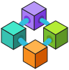 Consortium</td><td align="center"> Outbound Connection</td></tr></table>

<b>Compute (51)</b>

<table><tr><td align="center"> AKS Automatic</td><td align="center">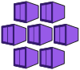 AKS</td><td align="center"> AVS VM</td><td align="center"> Application Group</td><td align="center"> Automanaged VM</td><td align="center"> Availability Sets</td></tr><tr><td align="center"> Azure Center For SAP</td><td align="center"> Azure Compute Galleries</td><td align="center"> Azure HPC Workbenches</td><td align="center"> Azure Linux</td><td align="center"> Azure VMware Solution</td><td align="center"> Azure Virtual Desktop</td></tr><tr><td align="center"> Bare Metal Infrastructure</td><td align="center"> Batch Accounts</td><td align="center"> Capacity Reservation Groups</td><td align="center"> Central Service Instance For SAP</td><td align="center"> Cloud Services (Classic)</td><td align="center"> Cloud Services (extended Support)</td></tr><tr><td align="center"> Community Images</td><td align="center"> Compute Fleet</td><td align="center"> Container Instances</td><td align="center"> Database Instance For SAP</td><td align="center"> Disk Encryption Sets</td><td align="center"> Disks Snapshots</td></tr><tr><td align="center"> Disks</td><td align="center"> Function Apps</td><td align="center"> Host Groups</td><td align="center"> Host Pools</td><td align="center"> Hosts</td><td align="center"> Image Definitions</td></tr><tr><td align="center"> Image Templates</td><td align="center">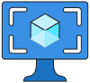 Images</td><td align="center"> Maintenance Configuration</td><td align="center"> Managed Service Fabric</td><td align="center"> Mesh Applications</td><td align="center"> Restore Points Collections</td></tr><tr><td align="center"> Restore Points</td><td align="center"> SSH Keys</td><td align="center"> Scheduled Actions</td><td align="center"> Service Fabric Clusters</td><td align="center"> Shared Image Galleries</td><td align="center"> Stage Maps</td></tr><tr><td align="center"> VM App Definitions</td><td align="center"> VM App Versions</td><td align="center"> VM Image Version</td><td align="center"> VM Images (Classic)</td><td align="center"> VM Scale Sets</td><td align="center"> Virtual Instance For SAP</td></tr><tr><td align="center"> Virtual Machine</td><td align="center"> Workspaces Alt</td><td align="center"> Workspaces</td></tr></table>

<b>Containers (12)</b>

<table><tr><td align="center"> AKS Istio</td><td align="center"> AKS Network Policy</td><td align="center"> Azure Container Storage</td><td align="center"> Azure Red Hat OpenShift</td><td align="center"> Container Apps Environments</td><td align="center"> Container Instances</td></tr><tr><td align="center"> Container Registries</td><td align="center"> Kubernetes Fleet Manager</td><td align="center"> Kubernetes Hub</td><td align="center"> Kubernetes Services</td><td align="center"> Service Groups</td><td align="center"> Worker Container App</td></tr></table>

<b>Databases (26)</b>

<table><tr><td align="center"> Azure Data Explorer Clusters</td><td align="center"> Azure Database MariaDB Server</td><td align="center"> Azure Database Migration Services</td><td align="center"> Azure Database MySQL Server</td><td align="center"> Azure Database PostgreSQL Server Group</td><td align="center"> Azure Database PostgreSQL Server</td></tr><tr><td align="center"> Azure DocumentDB</td><td align="center"> Azure Managed Redis</td><td align="center"> Azure SQL Edge</td><td align="center"> Azure SQL VM</td><td align="center"> Azure SQL</td><td align="center"> Cache Redis</td></tr><tr><td align="center"> Elastic Job Agents</td><td align="center"> Instance Pools</td><td align="center"> Managed Database</td><td align="center"> Managed Instance Apache Cassandra</td><td align="center"> Oracle Database</td><td align="center"> SQL Data Warehouses</td></tr><tr><td align="center"> SQL Database Fleet Manager</td><td align="center"> SQL Database</td><td align="center"> SQL Elastic Pools</td><td align="center"> SQL Managed Instance</td><td align="center"> SQL Server Registries</td><td align="center"> SQL Server</td></tr><tr><td align="center"> SSIS Lift And Shift IR</td><td align="center"> Virtual Clusters</td></tr></table>

<b>Developer Tools (3)</b>

<table><tr><td align="center"> Azure App Testing</td><td align="center"> Azure Dev Tunnels</td><td align="center"> Microsoft Dev Box</td></tr></table>

<b>DevOps (17)</b>

<table><tr><td align="center"> API Management Services</td><td align="center"> Application Insights</td><td align="center"> Azure Chaos Studio</td><td align="center"> Azure Deployment Environments</td><td align="center"> Azure DevOps</td><td align="center"> Azure Load Testing</td></tr><tr><td align="center">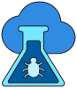 CloudTest</td><td align="center"> Code Optimization</td><td align="center"> DevOps Starter</td><td align="center"> DevTest Labs</td><td align="center"> Lab Accounts</td><td align="center"> Lab Services</td></tr><tr><td align="center"> Load Testing</td><td align="center"> Managed DevOps Pools</td><td align="center"> Targets Management</td><td align="center"> Test Base</td><td align="center"> Workspace Gateway</td></tr></table>

<b>General (104)</b>

<table><tr><td align="center"> All Resources</td><td align="center">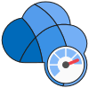 Aquila</td><td align="center"> Azure A</td><td align="center"> Azure Cloud Shell</td><td align="center"> Azure Support Center Blue</td><td align="center"> Backlog</td></tr><tr><td align="center"> Biz Talk</td><td align="center"> Blob Block</td><td align="center"> Blob Page</td><td align="center">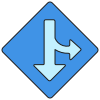 Branch</td><td align="center"> Breeze</td><td align="center"> Browser</td></tr><tr><td align="center">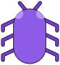 Bug</td><td align="center">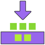 Builds</td><td align="center">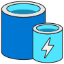 Cache</td><td align="center"> Ceres</td><td align="center">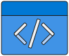 Code</td><td align="center">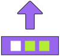 Commit</td></tr><tr><td align="center"> Controls Horizontal</td><td align="center">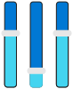 Controls</td><td align="center"> Cost Alerts</td><td align="center"> Cost Analysis</td><td align="center"> Cost Budgets</td><td align="center"> Cost Management</td></tr><tr><td align="center"> Counter</td><td align="center">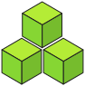 Cubes</td><td align="center"> Dashboard Hub</td><td align="center"> Dashboard</td><td align="center"> Dev Console</td><td align="center"> Download</td></tr><tr><td align="center">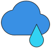 Error</td><td align="center"> Extensions</td><td align="center"> FTP</td><td align="center"> Fiji</td><td align="center"> File</td><td align="center"> Files</td></tr><tr><td align="center"> Folder Blank</td><td align="center"> Folder Website</td><td align="center"> Free Services</td><td align="center">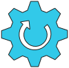 Gear</td><td align="center"> Globe Error</td><td align="center"> Globe Success</td></tr><tr><td align="center"> Globe Warning</td><td align="center">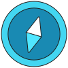 Guide</td><td align="center"> Heart</td><td align="center"> Help And Support</td><td align="center"> IcM Troubleshooting</td><td align="center"> Image</td></tr><tr><td align="center"> Information</td><td align="center"> Input Output</td><td align="center"> Journey Hub</td><td align="center"> Launch Portal</td><td align="center"> Learn</td><td align="center"> Load Test</td></tr><tr><td align="center"> Location</td><td align="center"> Log Streaming</td><td align="center"> Management Groups</td><td align="center"> Management Portal</td><td align="center"> Marketplace Management</td><td align="center"> Marketplace</td></tr><tr><td align="center"> Media File</td><td align="center">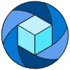 Media</td><td align="center"> Microsoft Discovery</td><td align="center"> Mobile Engagement</td><td align="center">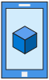 Mobile</td><td align="center">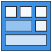 Module</td></tr><tr><td align="center"> Open Supply Chain Platform</td><td align="center"> Power Up</td><td align="center"> Power</td><td align="center">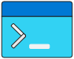 Powershell</td><td align="center"> Preview Features</td><td align="center"> Process Explorer</td></tr><tr><td align="center"> Production Ready Database</td><td align="center"> Quickstart Center</td><td align="center"> Recent</td><td align="center"> Region Management</td><td align="center"> Reservations</td><td align="center"> Resource Explorer</td></tr><tr><td align="center"> Resource Groups</td><td align="center"> Resource Linked</td><td align="center"> SSD</td><td align="center"> Scheduler</td><td align="center"> Search Grid</td><td align="center"> Search</td></tr><tr><td align="center"> Server Farm</td><td align="center"> Service Health</td><td align="center"> Storage Azure Files</td><td align="center"> Storage Container</td><td align="center"> Storage Queue</td><td align="center"> Subscriptions</td></tr><tr><td align="center"> TFS VC Repository</td><td align="center"> Table</td><td align="center"> Tag</td><td align="center"> Tags</td><td align="center"> Templates</td><td align="center">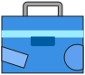 Toolbox</td></tr><tr><td align="center"> Troubleshoot</td><td align="center">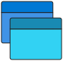 Versions</td><td align="center"> Web Slots</td><td align="center"> Web Test</td><td align="center"> Website Power</td><td align="center"> Website Staging</td></tr><tr><td align="center">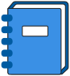 Workbooks</td><td align="center">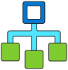 Workflow</td></tr></table>

<b>Hybrid + Multicloud (21)</b>

<table><tr><td align="center"> AI At Edge</td><td align="center"> Arc Data Services</td><td align="center"> Arc Kubernetes</td><td align="center"> Arc PostgreSQL</td><td align="center"> Arc SQL Managed Instance</td><td align="center"> Arc SQL Server</td></tr><tr><td align="center"> Azure Edge Hardware Center</td><td align="center"> Azure Local</td><td align="center"> Azure Monitor Pipeline</td><td align="center"> Azure Operator 5G Core</td><td align="center"> Azure Operator Insights</td><td align="center"> Azure Operator Nexus</td></tr><tr><td align="center"> Azure Programmable Connectivity</td><td align="center"> Disconnected Operations</td><td align="center"> Edge Management</td><td align="center"> Edge Storage Accelerator</td><td align="center"> Modular Data Center</td><td align="center"> SCVMM Management Servers</td></tr><tr><td align="center"> WAC Installer</td><td align="center">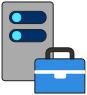 WAC</td><td align="center"> Workload Orchestration</td></tr></table>

<b>Identity (33)</b>

<table><tr><td align="center"> API Proxy</td><td align="center"> Administrative Units</td><td align="center"> App Registrations</td><td align="center"> Azure AD B2C</td><td align="center"> Enterprise Applications</td><td align="center"> Entra Connect Health</td></tr><tr><td align="center"> Entra Connect Sync</td><td align="center"> Entra Connect</td><td align="center"> Entra Domain Services</td><td align="center"> Entra Global Secure Access</td><td align="center"> Entra ID Protection</td><td align="center"> Entra Identity Custom Roles</td></tr><tr><td align="center"> Entra Identity Licenses</td><td align="center"> Entra Internet Access</td><td align="center"> Entra Private Access</td><td align="center"> Entra Privleged Identity Management</td><td align="center"> Entra Verified ID</td><td align="center"> Exchange On Premises Access</td></tr><tr><td align="center"> External Identities</td><td align="center"> Groups</td><td align="center"> Identity Governance</td><td align="center"> Managed Identities</td><td align="center"> Multi Factor Authentication</td><td align="center"> Multi Tenancy</td></tr><tr><td align="center"> Security</td><td align="center"> Tenant Properties</td><td align="center"> User Settings</td><td align="center"> User Subscriptions</td><td align="center"> Users</td><td align="center"> Verifiable Credentials</td></tr><tr><td align="center"> Verification As A Service</td><td align="center"> External Id Modified</td><td align="center"> External Id</td></tr></table>

<b>Integration (25)</b>

<table><tr><td align="center"> App Configuration</td><td align="center"> Azure API For FHIR</td><td align="center"> Azure Data Catalog</td><td align="center"> Azure Service Bus</td><td align="center"> Business Process Tracking</td><td align="center"> Event Grid Domains</td></tr><tr><td align="center"> Event Grid Subscriptions</td><td align="center"> Event Grid Topics</td><td align="center"> FHIR Service</td><td align="center"> Integration Accounts</td><td align="center"> Integration Environments</td><td align="center"> Integration Service Environments</td></tr><tr><td align="center"> Logic Apps Custom Connector</td><td align="center"> Logic Apps Template</td><td align="center"> Logic Apps</td><td align="center"> MedTech Service</td><td align="center"> Partner Namespace</td><td align="center"> Partner Registration</td></tr><tr><td align="center"> Partner Topic</td><td align="center">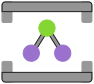 Relays</td><td align="center"> SendGrid Accounts</td><td align="center"> Software As A Service</td><td align="center"> StorSimple Device Managers</td><td align="center"> System Topic</td></tr><tr><td align="center">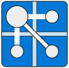 Pubsub</td></tr></table>

<b>Intune (17)</b>

<table><tr><td align="center"> Client Apps</td><td align="center"> Device Compliance</td><td align="center"> Device Configuration</td><td align="center"> Device Enrollment</td><td align="center"> Device Security Apple</td><td align="center"> Device Security Google</td></tr><tr><td align="center"> Device Security Windows</td><td align="center"> Devices</td><td align="center"> Engage Center Connect</td><td align="center"> Entra Identity Roles And Administrators</td><td align="center"> Exchange Access</td><td align="center">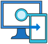 Intune</td></tr><tr><td align="center">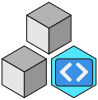 Mindaro</td><td align="center"> Security Baselines</td><td align="center"> Software Updates</td><td align="center"> Tenant Status</td><td align="center"> eBooks</td></tr></table>

<b>IoT (26)</b>

<table><tr><td align="center"> Azure Cosmos DB</td><td align="center"> Azure IoT Operations</td><td align="center"> Azure Maps Accounts</td><td align="center"> Azure Sphere</td><td align="center"> Azure Stack HCI Sizer</td><td align="center"> Connected Vehicle Platform</td></tr><tr><td align="center"> Device Provisioning Services</td><td align="center"> Device Update IoT Hub</td><td align="center"> Digital Twins</td><td align="center"> Event Hub Clusters</td><td align="center"> Event Hubs</td><td align="center"> Hybrid Connectivity Hub</td></tr><tr><td align="center"> Industrial IoT</td><td align="center"> IoT Central Applications</td><td align="center"> IoT Edge</td><td align="center"> IoT Hub</td><td align="center"> Machine Learning Studio Web Service Plans</td><td align="center"> Notification Hub Namespaces</td></tr><tr><td align="center">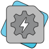 RTOS</td><td align="center"> Stack HCI Premium</td><td align="center"> Stream Analytics Jobs</td><td align="center"> Time Series Data Sets</td><td align="center"> Time Series Insights Access Policies</td><td align="center"> Time Series Insights Environments</td></tr><tr><td align="center"> Time Series Insights Event Sources</td><td align="center"> Windows10 Core Services</td></tr></table>

<b>Management + Governance (43)</b>

<table><tr><td align="center"> Advisor</td><td align="center"> Alerts</td><td align="center"> App Compliance Automation</td><td align="center"> Arc Machines</td><td align="center"> Automation Accounts</td><td align="center"> Azure Arc</td></tr><tr><td align="center"> Azure Consumption Commitment</td><td align="center"> Azure Lighthouse</td><td align="center"> Azure Quotas</td><td align="center"> Azure Sustainability</td><td align="center"> Blueprints</td><td align="center"> Compliance Center</td></tr><tr><td align="center"> Compliance</td><td align="center"> Cost Export</td><td align="center"> Cost Management And Billing</td><td align="center"> Customer Lockbox For Microsoft Azure</td><td align="center"> Education</td><td align="center"> Intune Trends</td></tr><tr><td align="center"> Landing Zone</td><td align="center"> Log Analytics Workspaces</td><td align="center">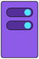 MachinesAzureArc</td><td align="center"> Managed Applications Center</td><td align="center"> Managed Desktop</td><td align="center">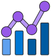 Metrics</td></tr><tr><td align="center"> Mission Landing Zone</td><td align="center"> OSConfig</td><td align="center"> Operation Log (Classic)</td><td align="center"> Policy</td><td align="center"> Reserved Capacity</td><td align="center"> Resiliency</td></tr><tr><td align="center"> Resource Graph Explorer</td><td align="center"> Resource Guard</td><td align="center"> Resources Provider</td><td align="center"> Savings Plans</td><td align="center"> Scheduler Job Collections</td><td align="center"> Service Catalog MAD</td></tr><tr><td align="center"> Service Group Relationships</td><td align="center"> Service Providers</td><td align="center">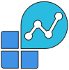 Solutions</td><td align="center"> Template Specs</td><td align="center"> Universal Print</td><td align="center"> Update Management Center</td></tr><tr><td align="center"> User Privacy</td></tr></table>

<b>Migration (3)</b>

<table><tr><td align="center"> Azure Data Transfer</td><td align="center"> Azure Migrate</td><td align="center"> Resource Mover</td></tr></table>

<b>Mixed Reality (2)</b>

<table><tr><td align="center"> Remote Rendering</td><td align="center"> Spatial Anchor Accounts</td></tr></table>

<b>Mobile (2)</b>

<table><tr><td align="center"> Notification Hubs</td><td align="center"> Windows Notification Services</td></tr></table>

<b>Monitor (13)</b>

<table><tr><td align="center"> Activity Log</td><td align="center"> Auto Scale</td><td align="center"> Azure Managed Grafana</td><td align="center"> Azure Monitor Dashboard</td><td align="center"> Azure Monitors For SAP Solutions</td><td align="center"> Change Analysis</td></tr><tr><td align="center"> Data Collection Rules</td><td align="center"> Diagnostics Settings</td><td align="center"> Log Analytics Query Pack</td><td align="center"> Monitor Health Models</td><td align="center">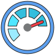 Monitor</td><td align="center"> Network Watcher</td></tr><tr><td align="center">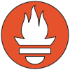 Promethus</td></tr></table>

<b>Networking (69)</b>

<table><tr><td align="center"> ATM Multistack</td><td align="center"> Application Gateway Containers</td><td align="center"> Application Gateways</td><td align="center"> Azure Access Point</td><td align="center"> Azure Communications Gateway</td><td align="center"> Azure Firewall Manager</td></tr><tr><td align="center"> Azure Firewall Policy</td><td align="center"> Azure Network Function Manager Functions</td><td align="center"> Azure Network Function Manager</td><td align="center"> Azure Orbital</td><td align="center"> Bastions</td><td align="center"> CDN Profiles</td></tr><tr><td align="center"> Connected Cache</td><td align="center"> Connections</td><td align="center"> Custom IP Prefix</td><td align="center"> DDoS Custom Policy</td><td align="center"> DDoS Protection Plans</td><td align="center"> DNS Multistack</td></tr><tr><td align="center"> DNS Private Resolver</td><td align="center"> DNS Security Policy</td><td align="center"> DNS Zones</td><td align="center"> Edge Actions</td><td align="center"> Express Route Traffic Collector</td><td align="center"> ExpressRoute Circuits</td></tr><tr><td align="center"> ExpressRoute Direct</td><td align="center">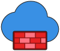 Firewalls</td><td align="center"> Front Door And CDN Profiles</td><td align="center"> IP Address Manager</td><td align="center"> IP Groups</td><td align="center"> Internet Analyzer Profiles</td></tr><tr><td align="center"> Load Balancer Hub Alt</td><td align="center"> Load Balancer Hub</td><td align="center"> Load Balancers</td><td align="center"> Local Network Gateways</td><td align="center"> Mobile Networks</td><td align="center">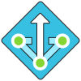 NAT</td></tr><tr><td align="center"> Network Foundation Hub</td><td align="center"> Network Interfaces</td><td align="center"> Network Managers</td><td align="center"> Network Security Groups</td><td align="center"> Network Security Hub</td><td align="center"> Network Security Perimeters</td></tr><tr><td align="center"> On Premises Data Gateways</td><td align="center"> Peering Service</td><td align="center">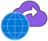 Peerings</td><td align="center"> Private Endpoints</td><td align="center"> Private Link Service</td><td align="center"> Private Link</td></tr><tr><td align="center"> Proximity Placement Groups</td><td align="center"> Public IP Addresses</td><td align="center"> Public IP Prefixes</td><td align="center"> Reserved IP Addresses (Classic)</td><td align="center"> Resource Management Private Link</td><td align="center"> Route Filters</td></tr><tr><td align="center"> Route Tables</td><td align="center"> Service Endpoint Policies</td><td align="center"> Sonic Dash</td><td align="center"> Spot VM</td><td align="center"> Spot VMSS</td><td align="center"> Subnet</td></tr><tr><td align="center"> Traffic Manager Profiles</td><td align="center"> VNet Appliance</td><td align="center"> VPNClientWindows</td><td align="center"> Virtual Network Gateways</td><td align="center"> Virtual Networks</td><td align="center"> Virtual Router</td></tr><tr><td align="center"> Virtual WAN Hub</td><td align="center"> Virtual WANs</td><td align="center"> Web Application Firewall Policies(WAF)</td></tr></table>

<b>Security (42)</b>

<table><tr><td align="center"> Application Security Groups</td><td align="center"> Azure Enclaves</td><td align="center"> Azure Information Protection</td><td align="center"> Azure Sentinel</td><td align="center"> AzureAttestation</td><td align="center"> Conditional Access</td></tr><tr><td align="center"> Confidential Ledgers</td><td align="center"> Dedicated HSM</td><td align="center"> Defender CM Local Manager</td><td align="center"> Defender DCS Controller</td><td align="center"> Defender Distributer Control System</td><td align="center"> Defender Engineering Station</td></tr><tr><td align="center"> Defender External Management</td><td align="center"> Defender Freezer Monitor</td><td align="center"> Defender HMI</td><td align="center"> Defender Historian</td><td align="center"> Defender Industrial Packaging System</td><td align="center"> Defender Industrial Printer</td></tr><tr><td align="center"> Defender Industrial Robot</td><td align="center"> Defender Industrial Scale System</td><td align="center"> Defender Marquee</td><td align="center"> Defender Meter</td><td align="center"> Defender PLC</td><td align="center"> Defender Pneumatic Device</td></tr><tr><td align="center"> Defender Programable Board</td><td align="center"> Defender RTU</td><td align="center"> Defender Relay</td><td align="center"> Defender Robot Controller</td><td align="center"> Defender Sensor</td><td align="center"> Defender Slot</td></tr><tr><td align="center"> Defender Web Guiding System</td><td align="center"> Detonation</td><td align="center"> Entra Identity Risky Signins</td><td align="center"> Entra Identity Risky Users</td><td align="center">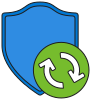 ExtendedSecurityUpdates</td><td align="center"> Identity Secure Score</td></tr><tr><td align="center"> Key Vaults</td><td align="center">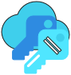 Keys</td><td align="center"> Microsoft Defender EASM</td><td align="center"> Microsoft Defender For Cloud</td><td align="center"> Microsoft Defender For IoT</td><td align="center"> Multifactor Authentication</td></tr></table>

<b>Storage (25)</b>

<table><tr><td align="center"> Azure Backup Center</td><td align="center"> Azure Databox Gateway</td><td align="center"> Azure Fileshares</td><td align="center"> Azure HCP Cache</td><td align="center"> Azure NetApp Files</td><td align="center"> Azure Storage Mover</td></tr><tr><td align="center">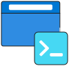 Azurite</td><td align="center"> Backup Vault</td><td align="center"> Data Box</td><td align="center"> Data Lake Storage Gen1</td><td align="center"> Data Share Invitations</td><td align="center"> Data Shares</td></tr><tr><td align="center"> Data Virtualization</td><td align="center"> Disk Pool</td><td align="center"> Elastic SAN</td><td align="center"> Import Export Jobs</td><td align="center"> Managed File Shares</td><td align="center"> Recovery Services Vaults</td></tr><tr><td align="center"> StorSimple Data Managers</td><td align="center"> Storage Accounts</td><td align="center"> Storage Actions</td><td align="center"> Storage Explorer</td><td align="center"> Storage Functions</td><td align="center"> Storage Hubs</td></tr><tr><td align="center"> Storage Sync Services</td></tr></table>

<b>Web (21)</b>

<table><tr><td align="center"> API Center</td><td align="center"> API Connections</td><td align="center"> Agentic Web Apps</td><td align="center"> App Service Certificates</td><td align="center"> App Service Domains</td><td align="center"> App Service Environments</td></tr><tr><td align="center"> App Service Plans</td><td align="center"> App Services</td><td align="center"> App Space Component</td><td align="center"> App Space</td><td align="center"> Azure Communication Services</td><td align="center"> Azure Media Service</td></tr><tr><td align="center"> Azure Spring Apps</td><td align="center"> Cognitive Search</td><td align="center"> Cognitive Services</td><td align="center"> Power Platform</td><td align="center"> SignalR</td><td align="center"> Static Apps</td></tr><tr><td align="center"> Virtual Visits Builder</td><td align="center"> Web App + Database</td><td align="center"> Web Jobs</td></tr></table>

### Dynamics 365 (16) &middot; [`dynamics-365-icons.excalidrawlib`](dynamics-365-icons.excalidrawlib)

<b>Dynamics 365 (16)</b>

<table><tr><td align="center"> Dynamics 365 Business Central</td><td align="center"> Dynamics 365 Commerce</td><td align="center"> Dynamics 365 Contact Center</td><td align="center"> Dynamics 365 Customer Insights</td><td align="center"> Dynamics 365 Customer Services</td><td align="center"> Dynamics 365 Customer Voice</td></tr><tr><td align="center"> Dynamics 365 Field Service</td><td align="center"> Dynamics 365 Finance Operations</td><td align="center"> Dynamics 365 Finance</td><td align="center"> Dynamics 365 Human Resources</td><td align="center"> Dynamics 365 Intelligent Order Management</td><td align="center"> Dynamics 365 Project Operations</td></tr><tr><td align="center"> Dynamics 365 Sales Insights</td><td align="center"> Dynamics 365 Sales</td><td align="center"> Dynamics 365 Supply Chain Management</td><td align="center"> Dynamics 365</td></tr></table>

### Microsoft Fabric (74) &middot; [`fabric-icons.excalidrawlib`](fabric-icons.excalidrawlib)

<b>Microsoft Fabric (74)</b>

<table><tr><td align="center"> Fabric Apps</td><td align="center"> Fabric Cohort</td><td align="center"> Fabric Copilot</td><td align="center"> Fabric Copy Job</td><td align="center"> Fabric Custom Streaming Connector</td><td align="center"> Fabric Dashboard</td></tr><tr><td align="center"> Fabric Data Agent</td><td align="center"> Fabric Data Engineering</td><td align="center"> Fabric Data Factory</td><td align="center"> Fabric Data Science</td><td align="center"> Fabric Data Warehouse</td><td align="center"> Fabric Databases</td></tr><tr><td align="center"> Fabric Dataflow Gen2</td><td align="center"> Fabric Dataflow</td><td align="center"> Fabric Datamart</td><td align="center"> Fabric Environment</td><td align="center"> Fabric Equal Off Circle 20 Regular</td><td align="center"> Fabric Event House</td></tr><tr><td align="center"> Fabric Eventstream</td><td align="center"> Fabric Experiments</td><td align="center"> Fabric Exploration</td><td align="center"> Fabric External Dataflow</td><td align="center"> Fabric External Datamart</td><td align="center"> Fabric External Semantic Model</td></tr><tr><td align="center"> Fabric Fabric</td><td align="center"> Fabric Folder</td><td align="center"> Fabric Function Set</td><td align="center"> Fabric Graph Intelligence</td><td align="center"> Fabric Graph Model Instance Queryset</td><td align="center"> Fabric Graph Model Instance</td></tr><tr><td align="center"> Fabric Group Workspace</td><td align="center"> Fabric Healthcare</td><td align="center"> Fabric Import Notebook</td><td align="center"> Fabric Industry Solutions</td><td align="center"> Fabric KQL Database</td><td align="center"> Fabric KQL Queryset</td></tr><tr><td align="center"> Fabric KQL Script</td><td align="center"> Fabric Lakehouse</td><td align="center"> Fabric Links</td><td align="center"> Fabric Metric Sets</td><td align="center"> Fabric Mirrored Generic Database</td><td align="center"> Fabric Mobile Report</td></tr><tr><td align="center"> Fabric Model</td><td align="center"> Fabric My Workspace</td><td align="center"> Fabric No Access Semantic Model</td><td align="center"> Fabric Notebook</td><td align="center"> Fabric One Lake</td><td align="center"> Fabric Operations Agent</td></tr><tr><td align="center"> Fabric Paginated Report</td><td align="center"> Fabric Pipeline</td><td align="center"> Fabric Planning</td><td align="center"> Fabric Power BI</td><td align="center"> Fabric Purview</td><td align="center"> Fabric Rdl Report</td></tr><tr><td align="center"> Fabric Real Time Dashboard</td><td align="center"> Fabric Real Time Intelligence</td><td align="center"> Fabric Report</td><td align="center"> Fabric Restricted Report</td><td align="center"> Fabric Restricted Scorecard</td><td align="center"> Fabric Retail</td></tr><tr><td align="center"> Fabric Runtime Lineage</td><td align="center"> Fabric SQL Database</td><td align="center"> Fabric Sample Workload</td><td align="center"> Fabric Sample</td><td align="center"> Fabric Schema Model</td><td align="center"> Fabric Scorecard</td></tr><tr><td align="center"> Fabric Semantic Model</td><td align="center"> Fabric Shared Semantic Model</td><td align="center"> Fabric Spark Job Direction</td><td align="center"> Fabric Streaming Dataflow</td><td align="center"> Fabric Streaming Semantic Model</td><td align="center"> Fabric Sustainability</td></tr><tr><td align="center"> Fabric User Data Function</td><td align="center"> Fabric Variable Library</td></tr></table>

### Generic (127) &middot; [`generic-icons.excalidrawlib`](generic-icons.excalidrawlib)

<b>Generic (127)</b>

<table><tr><td align="center"> Apps Blue</td><td align="center"> Apps List Detail Blue</td><td align="center"> Arrow Sync Blue</td><td align="center"> Attach Blue</td><td align="center"> Book Contacts</td><td align="center">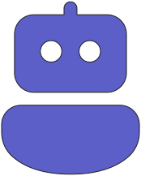 Bot</td></tr><tr><td align="center"> Building Blue</td><td align="center"> Building Cloud Blue</td><td align="center"> Building Multiple Blue</td><td align="center"> Building People Blue</td><td align="center"> Building Retail Blue</td><td align="center"> Calculator Blue</td></tr><tr><td align="center"> Calendar Month</td><td align="center"> Call</td><td align="center">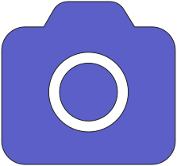 Camera</td><td align="center"> Cart Blue</td><td align="center"> Certificate Blue</td><td align="center"> Chart Multiple Blue</td></tr><tr><td align="center"> Chat Multiple</td><td align="center"> Chat</td><td align="center"> Clipboard Task List</td><td align="center"> Clock Alarm Blue</td><td align="center"> Clock</td><td align="center"> Cloud Beaker Blue</td></tr><tr><td align="center"> Cloud Blue</td><td align="center"> Cloud Cube Blue</td><td align="center"> Cloud Database Blue</td><td align="center"> Cloud Desktop Blue</td><td align="center"> Code Blue</td><td align="center"> Comment Multiple</td></tr><tr><td align="center"> Comment</td><td align="center"> Data Area Blue</td><td align="center"> Data Bar Vertical Blue</td><td align="center"> Data Pie Blue</td><td align="center"> Data Trending Blue</td><td align="center"> Data Usage Blue</td></tr><tr><td align="center"> Database Blue</td><td align="center"> Deploy Blue</td><td align="center"> Desktop Tower Blue</td><td align="center"> Document Blue</td><td align="center"> Document Bullet List Blue</td><td align="center"> Document Bullet List Multiple Blue</td></tr><tr><td align="center"> Document Key Blue</td><td align="center"> Document Lock Blue</td><td align="center"> Document Multiple Blue</td><td align="center"> Document Text Blue</td><td align="center"> Edit Blue</td><td align="center"> Filmstrip Play Blue</td></tr><tr><td align="center"> Fingerprint Blue</td><td align="center"> Flag Blue</td><td align="center"> Folder Multiple Blue</td><td align="center"> Folder Open Blue</td><td align="center"> Folder Open Vertical Blue</td><td align="center"> Folder People</td></tr><tr><td align="center"> Globe Blue</td><td align="center"> Grid Circles Blue</td><td align="center"> Handshake Blue</td><td align="center"> Hat Graduation Blue</td><td align="center"> Headset</td><td align="center"> Heart Pulse Blue</td></tr><tr><td align="center"> Image Blue</td><td align="center"> Key Blue</td><td align="center"> Laptop Blue</td><td align="center"> Layer Diagonal Blue</td><td align="center"> Lightbulb Blue</td><td align="center"> Lock Closed Blue</td></tr><tr><td align="center"> Lock Shield Blue</td><td align="center"> Mail Alert Blue</td><td align="center"> Mail Attach Blue</td><td align="center"> Mail Blue</td><td align="center"> Mail Error Blue</td><td align="center"> Mail Read Blue</td></tr><tr><td align="center"> Map Blue</td><td align="center"> Megaphone Loud</td><td align="center"> Merge Blue</td><td align="center"> Notebook Blue</td><td align="center"> Organization Horizontal Blue</td><td align="center"> Organization</td></tr><tr><td align="center"> Panel Left Header Blue</td><td align="center"> Panel Left Header Key Blue</td><td align="center"> Payment Blue</td><td align="center"> People Audience</td><td align="center"> People Community Blue</td><td align="center"> People Settings Blue</td></tr><tr><td align="center"> People Team</td><td align="center">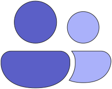 People</td><td align="center"> Person Accounts Blue</td><td align="center"> Person Blue</td><td align="center"> Person Desktop Blue</td><td align="center"> Person Settings Blue</td></tr><tr><td align="center"> Person Square Blue</td><td align="center"> Person Wrench Blue</td><td align="center"> Phone Blue</td><td align="center"> Phone Desktop Blue</td><td align="center"> Phone Laptop Blue</td><td align="center"> Phone Tablet Blue</td></tr><tr><td align="center"> Presenter</td><td align="center"> Question Circle Blue</td><td align="center"> Radar Blue</td><td align="center"> Receipt Blue</td><td align="center"> Ribbon Blue</td><td align="center"> Ribbon Star Blue</td></tr><tr><td align="center"> Script Blue</td><td align="center"> Select All Blue</td><td align="center"> Settings Blue</td><td align="center"> Settings Cog Multiple Blue</td><td align="center"> Shapes Three Blue</td><td align="center"> Share Blue</td></tr><tr><td align="center"> Shield Error Blue</td><td align="center"> Shifts Activity Blue</td><td align="center"> Shopping Bag Blue</td><td align="center"> Signature Blue</td><td align="center"> Tablet Blue</td><td align="center"> Tablet Laptop Blue</td></tr><tr><td align="center"> Tap Blue</td><td align="center"> Task List LTR</td><td align="center"> Task List Square</td><td align="center"> Text Bullet List Square</td><td align="center"> Text Bullet List</td><td align="center"> Toolbox Blue</td></tr><tr><td align="center"> Top Speed Blue</td><td align="center"> Video</td><td align="center"> Wallet Credit Card Blue</td><td align="center"> Window Blue</td><td align="center"> Window Dev Edit Blue</td><td align="center"> Window Edit Blue</td></tr><tr><td align="center"> Wrench Blue</td></tr></table>

### Microsoft 365 (2) &middot; [`microsoft-365-icons.excalidrawlib`](microsoft-365-icons.excalidrawlib)

<b>Microsoft 365 (2)</b>

<table><tr><td align="center"> Agent 365</td><td align="center"> SharePoint Organization</td></tr></table>

### Power Platform (7) &middot; [`power-platform-icons.excalidrawlib`](power-platform-icons.excalidrawlib)

<b>Power Platform (7)</b>

<table><tr><td align="center"> AI Builder</td><td align="center"> Copilot Studio</td><td align="center">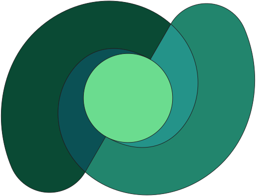 Dataverse</td><td align="center"> Power Apps</td><td align="center"> Power Automate</td><td align="center"> Power Pages</td></tr><tr><td align="center"> Power Platform</td></tr></table>

